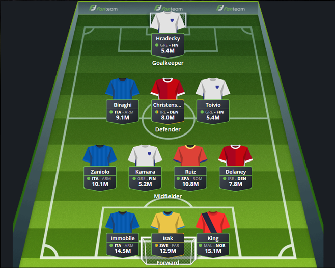

# Predicting-player-scores-in-Fantasy-Serie-A-using-Machine-Learning
This project has been developed for CentraleSupelec Foundations to Machine Learning course. Co-creator: Enrico Burigana.

## Project description
The goal of the project is to recommend high ROI football players in the Fantasy Serie A game. Based on three data sources, two machine learning models predict player scores in the next week's game. The predicted scores are then divided by the players' prices in Fantasy Serie A to identify low-cost, high-performance players that are likely to perform well in the upcoming game. Rules of Fantasy Football can be found [here](https://fantaera.com/regolamento) and [here](https://www.premierleague.com/news/1252542)

<a href="url"></a>
<br/>
<a href="url"></a>
<br/><br/><br/><br/><br/><br/><br/><br/><br/><br/><br/><br/>

## Tags
Machine learning, web scraping, regression, data analytics, Pandas, scikit-learn, multiple data sources, fantasy football, data processing

## Datasets
For this project data from 3 sources has been used
- Fantacalcio.it:
  - Dataset containing player scores (goals, assists, yellow cards, etc.)
  - Dataset containing each players week-on-week price
- Transfermarkt.com: data regarding player injuries and transfers has been web scraped from this website
- Elofootball.com: data regarding Elo ratings of each team has been obtained from this website

## Methodology
- Obtaining the data - datasets have been web scraped or downloaded from the respective websites
- Data processing - all datasets have been cleaned and joined together on the unique key [player, season, matchweek] or [team, season, matchweek]
- Feature engineering - around 100 new features have been generated in 3 categories:
  - Player based features - e.g. average goals scored in the last 5 games
  - Team based features - e.g. number of goals conceded by the team in the past 3 games
  - Game based features - e.g. home/away game or Elo rating difference
- Modelling - overall 4 models have been trained:
  - Two types of models have been trained: Random Forest Regressor and ElasticNet
  - The data has been divided into two datasets: goalkeepers and outfield players
- Return On Investment calculation - each predicted score has been divided by the price of a player following the formula
```
ROI = predicted score / log(price + 1)
```
- Recommendations - for every week a list like the one below has been generated:  <br/>

<a href="url"></a>
<a href="url"></a>
<a href="url"></a>
<a href="url"></a>

<br/><br/><br/><br/><br/><br/><br/><br/><br/><br/><br/><br/><br/><br/><br/><br/><br/><br/><br/><br/><br/><br/><br/><br/><br/><br/><br/><br/><br/><br/><br/><br/><br/><br/><br/><br/>

## Credits
This was a joint project, below are specified contributions per file:
- 0_web_scrap_transfermarkt.ipynb - Jedrzej Alchimowicz (Jen)
- 1_data_cleaning_and_merging.ipynb - Jedrzej Alchimowicz (Jen) & Enrico Burigana
- 2_feature_engineering.ipynb - Jedrzej Alchimowicz (Jen)
- 3_random_forest_elasticNet.ipynb - Jedrzej Alchimowicz (Jen)
